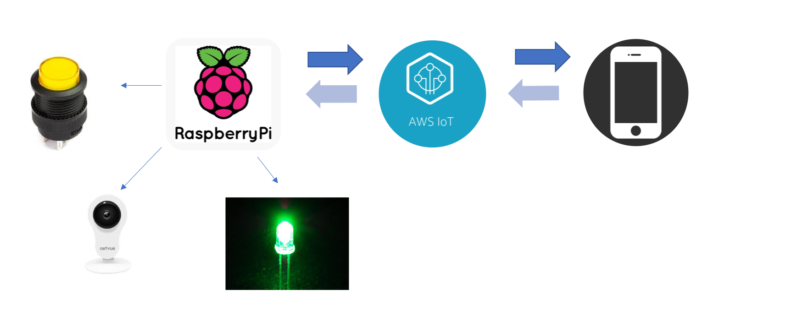
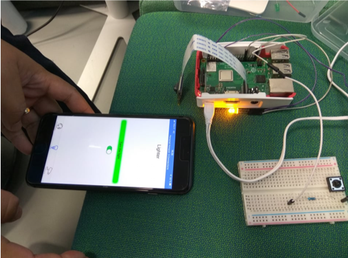

# AWS IoT + Raspberry Pi

## IoT Summer course

Exercise for elective summer course.

Learning objective:
- AWS IoT MQTT
- Raspberry Pi programming
- MQTT communication from iOS app

Languages:
- Python
- Swift

### Description
Raspberry Pi acts as a controller to the LED light. An iOS app is a management app to switch ON or OFF. Communicates to the raspberry Pi over the internet. A camera is also connected to the Pi to capture the actual state of the LED, whether it is ON or OFF and sends the image to the iOS app. This image serves as a feedback. A mini switch to for manually controlling the LED is also connected to the Pi.

### System Diagram

Pi <------> AWS IoT <-------> iOS App\
&nbsp;&nbsp;&nbsp;&nbsp;<--> Camera\
&nbsp;&nbsp;&nbsp;&nbsp;<--> LED\
&nbsp;&nbsp;&nbsp;&nbsp;<--> Button

